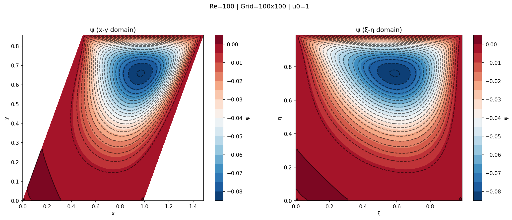

# Streamfunction-Vorticity solver 




## How to run
To run, first compile with make

```bash
make
```

Reccommended that you use multiple threads cause the imgui and sfml library does put some overhead

```bash
make -j18
```

Once done, run the sim binary

```bash
./bin/fluid_sim
```

Check images in the `Images` folder

## How it works
The physics and numerical details are in the `Report.pdf` file. This readme explains the code

### Initializations

We first initialize the velocities such that it is zero everywhere except the boundary. 
The functions for initializations are found in the `initializations.cpp`

### Boundary conditions
The boundary conditions for $\psi$ are enforced along with the update function, `solve_stream_function_update(...)`, of the interior domain.
For the vorticity, $\zeta$, we use the `solve_boundary_vorticity_values(...)` function in `core-sim-functions.cpp`

### Domain update
Viscocity and Semi lagrange advection is first performed on the viscocity using the cached velocities. This is done in the `solve_vorticity_transport(...)` function.

Then stream functions values and then solved for using the updated vorticity ($\omega$) values. The `solve_stream_function_update(...)` function is used for this.

Using the updated stream function values, the velocities are calculated and cached with the `solve_velocity_update(...)`

All the functions are in `core-sim-functions.cpp`

### Interpolation:
In order to use semi-lagrangian advection, we need interpolated values at non-nodal positions. For this, bilinear interpolation is used.
`find_velocity_at_point(...)` and `find_vorticity_at_point(...)` from `aux.cpp` handle this task.


### Other stuff:
`plot_state_cache.py` and `plot_velocity_centerlines.py` are subprograms that are called when the button to plot is clicked from the menu. The action causes the local state to be saved in two text files and then the python program is called with appropriate arguements. 

`map_screen_to_world(...)` is used to map from the display domain onto the physics domain. 

`OpenMP` is used to parallelize loops and speed up computation